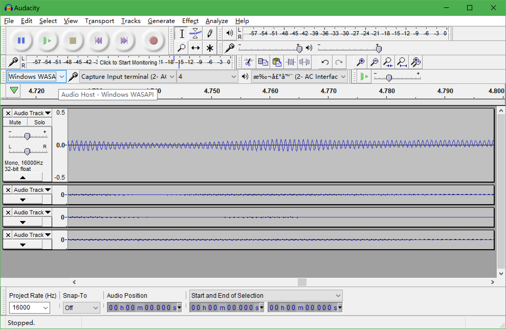

# As a USB sound card

By the default, the micro USB port of the Nanopi Neo Air is used as a serial port.
While it can also be used a USB sound card.

1.  rm `g_serial` from the file `/etc/module` and reboot.

2.  run the script to setup a USB Audio Class 1.0 (UAC1) device

    ```shell
    #!/bin/bash
    modprobe libcomposite
    mkdir -p /sys/kernel/config/usb_gadget/g
    echo 0x1d6b > /sys/kernel/config/usb_gadget/g/idVendor  # Linux Foundation
    echo 0x0104 > /sys/kernel/config/usb_gadget/g/idProduct # Multifunction Composite Gadget
    echo 0x0100 > /sys/kernel/config/usb_gadget/g/bcdDevice # v1.0.0
    echo 0x0200 > /sys/kernel/config/usb_gadget/g/bcdUSB    # USB 2.0
    echo 0xef > /sys/kernel/config/usb_gadget/g/bDeviceClass    # USB 2.0
    echo 0x02 > /sys/kernel/config/usb_gadget/g/bDeviceSubClass # USB 2.0
    echo 0x01 > /sys/kernel/config/usb_gadget/g/bDeviceProtocol # USB 2.0
    mkdir -p  /sys/kernel/config/usb_gadget/g/strings/0x409
    echo "000001" > /sys/kernel/config/usb_gadget/g/strings/0x409/serialnumber
    echo "VOICEN" > /sys/kernel/config/usb_gadget/g/strings/0x409/manufacturer
    echo "devkit" > /sys/kernel/config/usb_gadget/g/strings/0x409/product
    mkdir -p /sys/kernel/config/usb_gadget/g/functions/uac1.usb0   # audio
    echo 0x1 > /sys/kernel/config/usb_gadget/g/functions/uac1.usb0/c_chmask
    echo 48000 > /sys/kernel/config/usb_gadget/g/functions/uac1.usb0/c_srate
    echo 0xf > /sys/kernel/config/usb_gadget/g/functions/uac1.usb0/p_chmask
    echo 16000 > /sys/kernel/config/usb_gadget/g/functions/uac1.usb0/p_srate
    mkdir -p /sys/kernel/config/usb_gadget/g/configs/c.1
    echo 250 > /sys/kernel/config/usb_gadget/g/configs/c.1/MaxPower
    ln -s /sys/kernel/config/usb_gadget/g/functions/uac1.usb0  /sys/kernel/config/usb_gadget/g/configs/c.1/
    udevadm settle -t 5 || :
    ls /sys/class/udc/ > /sys/kernel/config/usb_gadget/g/UDC
    ```

3.  run `aplay -l` and `areocrd -l` to check the virtual capture/playback devices created by the script

    ```
    $ aplay -l
    **** List of PLAYBACK Hardware Devices ****
    card 0: Codec [H3 Audio Codec], device 0: CDC PCM Codec-0 []
    Subdevices: 1/1
    Subdevice #0: subdevice #0
    card 2: UAC1Gadget [UAC1_Gadget], device 0: UAC1_PCM [UAC1_PCM]
    Subdevices: 1/1
    Subdevice #0: subdevice #0
    $ arecord -l
    **** List of CAPTURE Hardware Devices ****
    card 0: Codec [H3 Audio Codec], device 0: CDC PCM Codec-0 []
    Subdevices: 1/1
    Subdevice #0: subdevice #0
    card 1: voicen4mic [voicen4mic], device 0: 1c22000.i2s-ac108-codec0 ac108-codec.0-003b-0 []
    Subdevices: 1/1
    Subdevice #0: subdevice #0
    card 2: UAC1Gadget [UAC1_Gadget], device 0: UAC1_PCM [UAC1_PCM]
    Subdevices: 1/1
    Subdevice #0: subdevice #0
    ```

4.  when playing an audio through the USB sound card on a computer, the audio is sent to the capture device `hw:UAC1Gadget`, and then run `arecord -f S16_LE -c 1 -r 48000 -D hw:UAC1Gadget | aplay` to play the audio on the device.

5.  when recording through the sound card on the computer, data is sent from the playback device `hw:UAC1Gadget` to the computer.

    a. use [Audacity](https://www.audacityteam.org/) to record audio on a computer.

    To reocrd 4 (more than 2) channels audio, Windows WASAPI is selected

    

    b. run `arecord -f S16_LE -c 4 -r 16000 | aplay -D hw:UAC1Gadget` to send microphone data to the computer.
